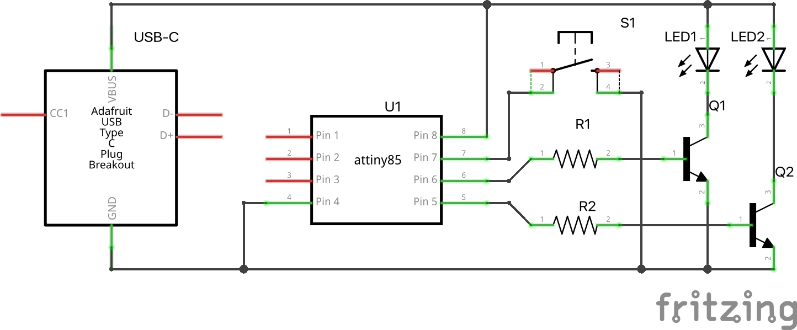
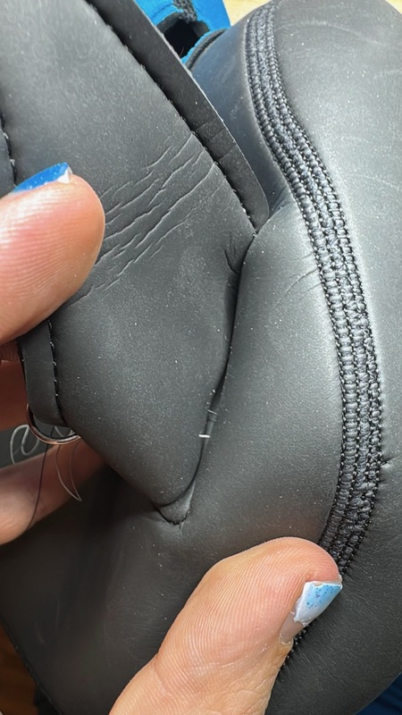
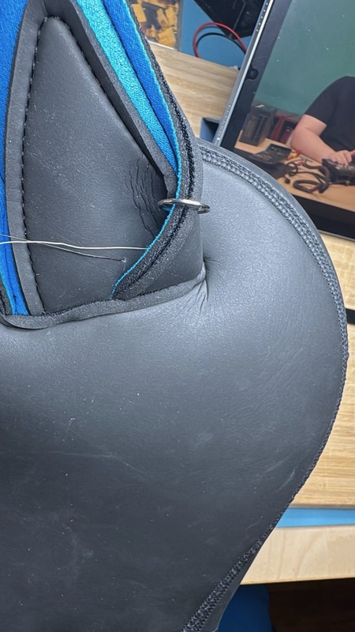
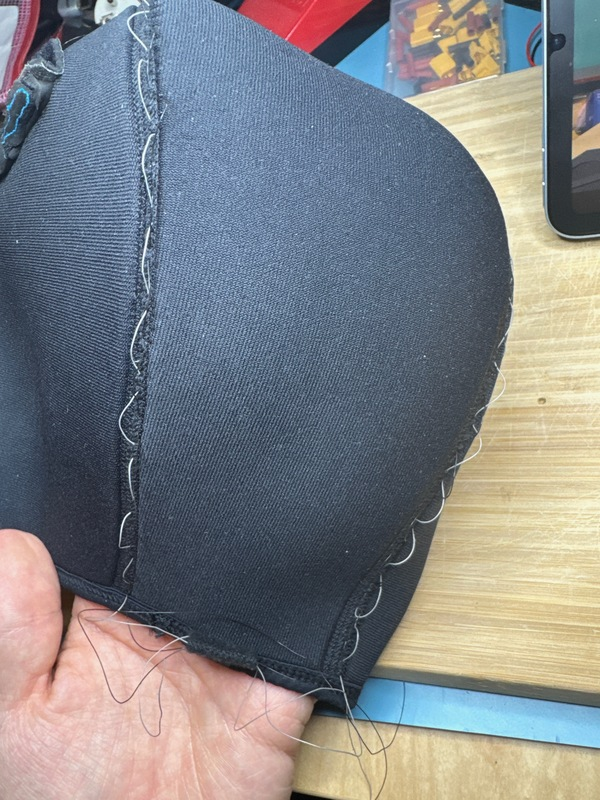
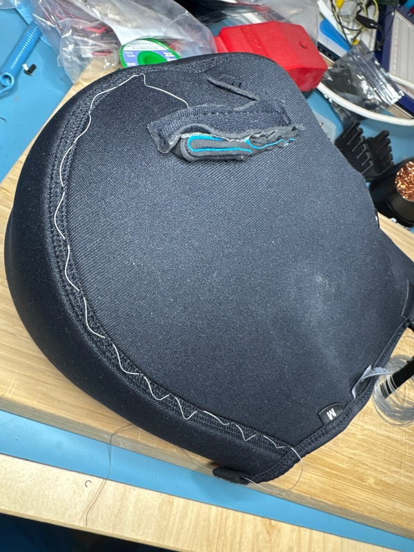
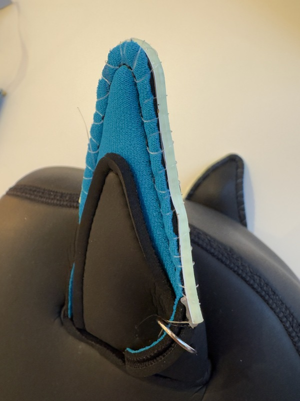
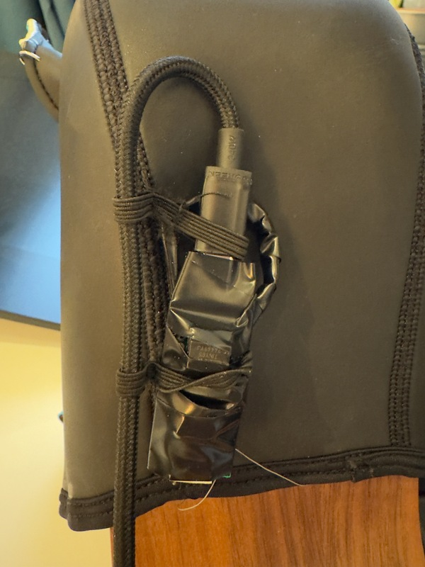
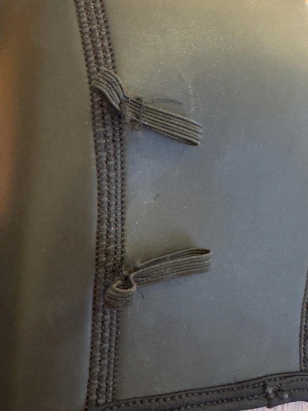

# Blinky Dogears

[Blink Patterns](img/blink/README.md)

## Used components

* 5V COB LED Strip 3mm ([AliExpress](https://aliexpress.com/item/1005006461651051.html))
* ATTINY85-20PU ([AliExpress](https://aliexpress.com/item/32952226916.html))
* 36AWG (0.0127 mm²) Wire ([AliExpress](https://aliexpress.com/item/4001028437947.html))
* USB-C Breakout board ([AliExpress](https://aliexpress.com/item/1005009464868914.html))
* 2N2222 Transistor ([AliExpress](https://aliexpress.com/item/1005002840840376.html))
* Elastic Band ([Amazon](https://www.amazon.com/dp/B0F59RBNKZ))

## PCB

## Photos

(YES THE MOUNTING NEEDS SOME WORK)

